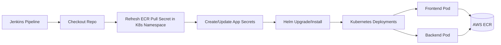

# Learner Report – Kubernetes Deployment via Jenkins

This repository contains the **Helm chart** and **Jenkins pipeline** configuration for deploying the Learner Report application (frontend & backend) to a Kubernetes namespace.  
Images are stored in **AWS ECR** and pulled by the cluster using ECR authentication.

---

## 📂 Repository Structure
├── learner-report-chart/ # Helm chart for frontend & backend deployments  
├── frontend_deployment.yaml # (Helm templated) Frontend deployment manifest  
├── backend_deployment.yaml # (Helm templated) Backend deployment manifest  
├── backend-service.yaml # Kubernetes service template for backend  
├── frontend-service.yaml # Kubernetes service template for frontend  
├── Jenkinsfile # Jenkins pipeline definition  
└── README.md # This file

---

## 🛠 Prerequisites

Before running the pipeline, ensure you have:

- **AWS CLI** configured with permissions to:
  - Authenticate (`ecr:GetAuthorizationToken`)
  - Pull images from ECR
- **AWS ECR** repositories:
  - `learner-report-front-end`
  - `learner-report-backend`
- **Kubernetes cluster** accessible to Jenkins (e.g., Minikube, EKS, GKE)
- **Helm** installed in Jenkins agent environment
- **Jenkins Plugins**:
  - AWS Credentials Plugin
  - Pipeline: AWS Steps
  - Kubernetes CLI
  - Credentials Binding
  - Git plugin

---

## 🔑 Required Jenkins Credentials

In **Jenkins → Manage Jenkins → Credentials**, create:

| ID                     | Type                              | Description |
|------------------------|-----------------------------------|-------------|
| `aws-creds`            | AWS Credentials                   | AWS Access Key ID & Secret |
| `kubeconfig`           | Secret file                       | `~/.kube/config` file for the target cluster |
| `ATLAS_URI`            | Secret text                       | MongoDB connection string |
| `HASH_KEY`             | Secret text                       | Backend hash key |
| `JWT_SECRET_KEY`       | Secret text                       | JWT signing secret |

---

## 🚀 How to Run the Pipeline

1. **Clone the repository** into Jenkins or connect it to your Git source.
2. In Jenkins, create a **Pipeline job** and set:
   - **Pipeline script from SCM**
   - Repository URL and branch
3. Run the job — the pipeline will:
   1. **Checkout** the source code
   2. **Refresh ECR pull secret** in the target namespace
   3. **Create/Update backend secrets** in Kubernetes
   4. **Deploy via Helm** to namespace `learner-report`
4. Check deployment status:
   ```bash
   kubectl get pods -n learner-report
   kubectl get svc -n learner-report
   ```
   
   ## 🧠 How It Works

-   **Images** are stored in private AWS ECR.
    
-   The pipeline **refreshes ECR credentials** every run (tokens expire in 12h).
    
-   Helm is used to **upgrade or install** the release:
    
    -   Frontend image: `ECR_REPO_FE:latest`
        
    -   Backend image: `ECR_REPO_BE:latest`
        
-   Deployments include:
    
    -   `imagePullSecrets: ecr-pull-secret` (to authenticate to ECR)
        
    -   Environment variables via Kubernetes secrets

## ⚠️ Troubleshooting

### `ImagePullBackOff`

-   Check if `ecr-pull-secret` exists in `learner-report` namespace:
	```bash
	kubectl get secret ecr-pull-secret -n learner-report

	```
- If missing or expired, recreate:

	```bash
	aws ecr get-login-password --region ap-south-1 \
	  | kubectl create secret docker-registry ecr-pull-secret \
	      --docker-server=<account-id>.dkr.ecr.ap-south-1.amazonaws.com \
	      --docker-username=AWS \
	      --docker-password-stdin \
	      -n learner-report
	```
	
### `services "<name>" already exists`

-   This means the service exists outside Helm's control.
    
-   Delete it before deploying:

	```bash
	kubectl delete svc <service-name> -n learner-report
	```
## 📝 Example Jenkins Run
```bash
# Refresh pull secret
kubectl create secret docker-registry ecr-pull-secret \
  --docker-server=1645443951666.dkr.ecr.ap-south-1.amazonaws.com \
  --docker-username=AWS \
  --docker-password="$(aws ecr get-login-password --region ap-south-1)" \
  -n learner-report \
  --dry-run=client -o yaml | kubectl apply -f -

# Deploy with Helm
helm upgrade --install learner-report learner-report-chart \
    --namespace learner-report \
    --create-namespace \
    --set frontend.image=1645443951666.dkr.ecr.ap-south-1.amazonaws.com/learner-report-front-end:latest \
    --set backend.image=1645443951666.dkr.ecr.ap-south-1.amazonaws.com/learner-report-backend:latest \
    --set deployTimestamp="$(date +%s)"
```
## 📌 Notes

-   Always refresh the pull secret before each deploy.
    
-   Helm will update Deployments, Services, and ConfigMaps if any changes are detected.
    
-   Use `kubectl rollout status deployment/<name> -n learner-report` to monitor updates.

## 📊 Deployment Flow Diagram


